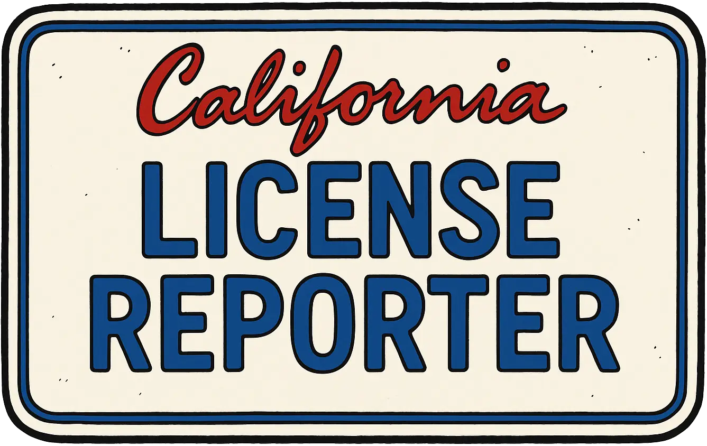

# Plate Reporter

Community-driven traffic safety reporting. Submit incidents with license plates, locations, vehicle details, and optional media. Browse a public feed with filtering and infinite scrolling.

<p align="center">
  
</p>

<div align="center">

[](#)
[](#)
[](#)
[](#)
[](#)
[](#)

</div>

---

## Table of Contents

- [Features](#features)
- [Architecture](#architecture)
- [Tech Stack](#tech-stack)
- [Getting Started](#getting-started)
- [Environment Variables](#environment-variables)
- [Project Structure](#project-structure)
- [Data Model](#data-model)
- [Validation Rules](#validation-rules)
- [API](#api)
- [UX Details](#ux-details)
- [Security & Privacy](#security--privacy)
- [Performance Notes](#performance-notes)
- [Accessibility](#accessibility)
- [Quality (Linting/Types/Formatting)](#quality-lintingtypestformatting)
- [Deployment](#deployment)
- [Roadmap](#roadmap)
- [License](#license)

---

## Features

- **Report form** with strong client-side validation (Zod).
- **License plate normalization** (uppercasing, trimming, length caps).
- **Guided city selection** by state with datalist suggestions.
- **Rich metadata**: vehicle type, color picker, make/model/year, observed gender, description.
- **Optional geotagging** via browser geolocation or manual map click.
- **Media uploads**: images/videos (up to 5 files, 25MB each); basic previews; video duration extraction.
- **Client-side EXIF stripping** for images to protect location privacy.
- **Public feed** with filters, responsive cards, and infinite “Load More”.
- **Optimistic update**: newly submitted report appears immediately.
- **Robust network UX**: toasts for success/error, upload progress with `XMLHttpRequest`.
- **Map thumbnails** where location exists.

---

## Architecture

This is a client-heavy Next.js app (App Router or Pages Router compatible). The UI lives in a single client component (`LicensePlateReporter`) and interacts with server endpoints:

- `GET /api/reports` — list with filters + cursor pagination  
- `POST /api/reports` — multipart form submissions with media

Key client modules:

- `./lib/constants` — enumerations for states, violations, vehicle types, colors, genders.  
- `./components/MapComponent` — interactive map used for location selection and thumbnails.  
- `./cities.json` — canonical list of cities per state (used to validate a city belongs to a state).

> **Note:** This README documents the public contract of the API the UI expects. You can implement the server with your preferred DB/object storage.

---

## Tech Stack

- **Framework:** Next.js 13+ (React 18)
- **Language:** TypeScript
- **Styling:** Tailwind CSS
- **Validation:** Zod
- **Icons:** `lucide-react`
- **Maps:** Implemented via `MapComponent` (bring your own provider: Leaflet, Mapbox GL JS, Google Maps, etc.)
- **Uploads:** `XMLHttpRequest` for progress events (server expects a multipart form)

---

## Getting Started

### Prerequisites

- Node.js 18+
- PNPM/NPM/Yarn (examples use `npm`)

### Install

```bash
npm install
```

### Develop

```bash
npm run dev
```

Open http://localhost:3000.

### Build

```bash
npm run build
npm start
```

---

## Environment Variables

Depending on your map provider and storage, you may need:

```bash
# Maps (choose one provider and wire it inside MapComponent)
NEXT_PUBLIC_MAPBOX_TOKEN=...
NEXT_PUBLIC_GOOGLE_MAPS_API_KEY=...

# File storage / backend (if using object storage or presigned URLs)
# S3_* or GCS_* etc.
```

> Make sure `MapComponent` reads the correct variables and provider SDK as needed.

---

## Project Structure

```
.
├─ app/ or pages/
│  ├─ api/
│  │  └─ reports/
│  │     ├─ route.ts      # (App Router) GET/POST handlers (you implement)
│  │     └─ index.ts      # (Pages Router) API route equivalent
│  └─ page.tsx            # or a feature page hosting the component
├─ components/
│  └─ MapComponent.tsx    # provider-specific map wrapper
├─ lib/
│  └─ constants.ts        # US_STATES, VIOLATIONS, VEHICLE_TYPES, COLORS, GENDERS
├─ public/
│  └─ assets/License_Reporter_Logo.webp
├─ cities.json            # { "Alabama": ["Birmingham", ...], ... }
└─ LicensePlateReporter.tsx
```

> The sample above reflects references in the component you shared; adjust paths to match your project.

---

## Data Model

### `Report` (client shape)

```ts
interface Report {
  id: string;
  plate: string;
  state_code: string;
  city: string;
  violation: string;
  vehicle_type: string;
  color: string;
  make?: string;
  model?: string;
  year?: number;
  gender_observed?: string;
  description?: string;
  reporter_email?: string;
  contact_ok: boolean;
  incident_at: string;
  created_at: string;
  media_count: number;
  latitude?: number;
  longitude?: number;
}
```

---

## License

This project is provided “as is.” Choose a license that fits your needs (MIT, Apache-2.0, etc.) and add it to `LICENSE`.
